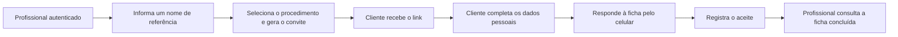
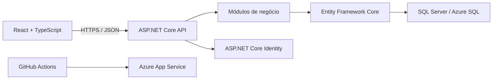

# Ficha Digital — Manuscrito Estudio

[](https://github.com/Felipe-everardo/ficha-digital/actions/workflows/ci.yml)
[](https://github.com/Felipe-everardo/ficha-digital/actions/workflows/main_fichadigital.yml)

Aplicação full stack criada para substituir fichas de anamnese em papel por um
fluxo digital seguro, rastreável e acessível pelo celular em estúdios de
tatuagem e piercing.

[Acessar a aplicação publicada](https://fichadigital-f0ffagenh8gegvea.eastus-01.azurewebsites.net/profissional/entrar)

### Acesso de demonstração

Para conhecer o fluxo da área profissional, utilize a conta de demonstração:

```text
E-mail: feeverardo@gmail.com
Senha: @FePassword123
```

Essa conta e os dados disponíveis no ambiente são exclusivamente fictícios e
destinados à avaliação do projeto.

> O acesso profissional é protegido por autenticação. O projeto está publicado
> como MVP de demonstração e ainda não deve receber dados pessoais reais.

## Visão geral

O projeto nasceu de um problema real: o estúdio utilizava formulários em papel,
o que dificultava a leitura, a localização de fichas antigas e a preservação do
histórico de cada cliente.

A solução permite que o profissional cadastre apenas um nome de referência,
informe se o procedimento é uma tatuagem ou um piercing e gere um link
temporário para envio pelo aplicativo de mensagens de sua preferência. O
cliente abre o link no celular, confere o procedimento e o profissional
responsável, completa os próprios dados, responde ao histórico de saúde e
registra o aceite do termo. Ao final, o profissional acompanha a confirmação e
o histórico do cliente em uma área protegida.



## Demonstração visual

Esta seção está preparada para apresentar as principais etapas do produto:

1. tela de login;
2. painel do profissional;
3. link de convite enviado ao cliente;
4. clientes cadastrados.

<!--
Adicione os arquivos em docs/screenshots e remova este comentário.

| Acesso profissional | Painel do profissional |
| :---: | :---: |
|  |  |

| Convite enviado | Clientes cadastrados |
| :---: | :---: |
|  |  |
-->

## Funcionalidades do MVP

### Área profissional

- autenticação com sessão protegida;
- cadastro inicial do cliente somente por nome de referência;
- busca de clientes por nome, contato e dados da ficha mais recente;
- histórico de fichas e procedimentos por cliente;
- geração de convite com validade de 1 hora, procedimento e profissional
  responsável registrados automaticamente;
- link completo pronto para cópia e compartilhamento;
- histórico completo das fichas, mantendo a ficha mais recente em
  destaque na listagem de clientes;
- consulta protegida dos dados preenchidos e do resumo do aceite;
- preservação dos dados pessoais confirmados em cada ficha, sem reescrever o
  histórico quando o cadastro geral do cliente for atualizado;
- separação entre listagens administrativas e informações sensíveis.

### Experiência do cliente

- abertura da ficha por link temporário;
- validação segura do convite;
- identificação do procedimento e do profissional responsável;
- preenchimento dos próprios dados pessoais e de contato;
- revisão e atualização dos dados anteriores quando o cliente retorna para um
  novo atendimento;
- questionário de saúde com perguntas condicionais;
- retomada do fluxo pelo link original;
- apresentação e aceite do termo de consentimento;
- confirmação da conclusão da ficha.

## Destaques técnicos

- **Monólito modular:** mantém a implantação simples sem misturar os domínios
  de clientes, fichas e profissionais.
- **Tokens seguros:** o token original do convite é exibido somente na emissão;
  apenas seu hash é persistido no banco.
- **Segurança em camadas:** cookies `HttpOnly`, proteção antifalsificação,
  limitação de requisições públicas, bloqueio por tentativas de login e
  respostas sensíveis sem cache.
- **Contratos HTTP explícitos:** DTOs de entrada e saída impedem que entidades
  do domínio sejam expostas diretamente.
- **Histórico imutável:** cada ficha mantém um retrato dos dados pessoais
  confirmados pelo cliente naquele preenchimento.
- **Validação em duas fronteiras:** dados inválidos são rejeitados tanto na API
  quanto pelas regras internas do domínio.
- **Qualidade automatizada:** testes unitários e de integração, lint e build do
  frontend executados pelo GitHub Actions.
- **Entrega contínua:** publicação no Azure App Service por OIDC, sem senha de
  implantação armazenada no workflow.

## Arquitetura

A aplicação utiliza React e TypeScript no frontend, ASP.NET Core no backend e
SQL Server para persistência. O Entity Framework Core mantém o schema do banco
versionado por migrations.



```text
Modules/
├── Clientes/
│   ├── Api/             # Controllers e contratos HTTP
│   ├── Application/     # Casos de uso e consultas da aplicação
│   ├── Domain/          # Entidades e regras de negócio
│   └── Infrastructure/  # Persistência e mapeamentos
├── Fichas/
└── Profissionais/
```

No frontend, as rotas ficam isoladas em `app`, as integrações HTTP são
separadas por módulo em `services` e o fluxo público da ficha distribui estado,
regras de interação e apresentação entre `hooks`, `pages` e `components`.

## Tecnologias

| Camada | Tecnologias |
| --- | --- |
| Backend | C#, .NET 10, ASP.NET Core Web API, Entity Framework Core 10 |
| Autenticação | ASP.NET Core Identity, cookies seguros e antiforgery |
| Frontend | React 19, TypeScript, Vite e CSS responsivo |
| Banco de dados | SQL Server LocalDB e Azure SQL Database |
| Testes | xUnit v3, testes unitários e de integração |
| DevOps | GitHub Actions, Azure App Service e autenticação OIDC |

## Estrutura do repositório

```text
FichaDigital/
├── .github/workflows/                 # CI e publicação no Azure
├── src/
│   ├── backend/FichaDigital.Api/      # API e domínio da aplicação
│   └── frontend/                      # Interface React
├── tests/backend/
│   ├── FichaDigital.UnitTests/
│   └── FichaDigital.IntegrationTests/
├── FichaDigital.sln
└── README.md
```

## Executando localmente

### Pré-requisitos

- [.NET SDK 10](https://dotnet.microsoft.com/download/dotnet/10.0);
- [Node.js 24](https://nodejs.org/);
- SQL Server LocalDB ou outra instância do SQL Server;
- npm.

Na raiz do repositório, restaure as dependências e aplique as migrations:

```powershell
dotnet restore
dotnet tool restore
dotnet tool run dotnet-ef database update `
  --project src/backend/FichaDigital.Api `
  --startup-project src/backend/FichaDigital.Api
```

Configure uma conta profissional usando o
[Secret Manager do .NET](https://learn.microsoft.com/aspnet/core/security/app-secrets)
nas chaves abaixo, sem versionar a senha:

```text
ProfissionalDesenvolvimento:NomeCompleto
ProfissionalDesenvolvimento:Email
ProfissionalDesenvolvimento:Senha
```

### Redefinição administrativa da senha no Azure

Se a conta profissional já existir e a senha precisar ser trocada, configure
temporariamente estas variáveis no App Service:

```text
ProfissionalInicial__Habilitado=true
ProfissionalInicial__RedefinirSenhaSeExistente=true
ProfissionalInicial__NomeCompleto=Nome do profissional
ProfissionalInicial__Email=email-da-conta
ProfissionalInicial__Senha=nova-senha
```

Reinicie a aplicação e confirme o acesso com a nova senha. Em seguida,
desabilite `ProfissionalInicial__Habilitado` e
`ProfissionalInicial__RedefinirSenhaSeExistente`, remova
`ProfissionalInicial__Senha` e reinicie novamente. A redefinição também remove
um eventual bloqueio causado por tentativas de login inválidas.

Inicie a API e o frontend em terminais separados:

```powershell
dotnet run --project src/backend/FichaDigital.Api --launch-profile http
```

```powershell
npm --prefix src/frontend install
npm --prefix src/frontend run dev
```

O frontend será disponibilizado normalmente em `http://localhost:5173` e a API
em `http://localhost:5057`.

### Migrations e limpeza dos dados de demonstração

No ambiente local, a API aplica automaticamente as migrations pendentes antes
de provisionar a conta profissional. Em produção, esse comportamento fica
desativado por padrão para que uma falha de permissão ou conexão no Azure SQL
não impeça a inicialização do App Service.

Depois de validar as migrations separadamente no Azure SQL, a aplicação pode
executá-las no startup por meio da configuração
`DatabaseInitialization__ApplyMigrationsOnStartup=true` no App Service.

Para apagar somente clientes e fichas fictícias, preservando contas
profissionais e o histórico de migrations, execute o script
[`scripts/reset-demo-data.sql`](scripts/reset-demo-data.sql) no banco correto.
O script usa uma transação, respeita a ordem das chaves estrangeiras e exibe a
contagem final das tabelas afetadas.

Para substituir os registros por uma base de demonstração mais completa,
execute [`scripts/seed-demo-data.sql`](scripts/seed-demo-data.sql). A carga é
repetível e cria 12 clientes e 16 fichas completas em diferentes dias, meses e
anos, incluindo clientes com mais de uma ficha. As datas são calculadas a
partir do dia da execução para facilitar o teste dos filtros.

A carga também garante os perfis fictícios Lia e Taty, com especialidade em
tatuagem, e Thais, com especialidade em body piercing. Esses perfis não recebem
senha e não podem entrar no aplicativo; a conta profissional já configurada é
preservada.

```powershell
sqlcmd -S "(localdb)\MSSQLLocalDB" -E -C -d FichaDigitalDb `
  -b -i "scripts\seed-demo-data.sql"
```

> Confirme o nome do servidor e do banco antes da execução. Os dois scripts
> excluem permanentemente clientes, fichas, dados pessoais confirmados,
> questionários, aceites e convites existentes no banco selecionado.

O endpoint `GET /api/status/database` pode ser usado pelo Azure Health Check
para confirmar que a aplicação consegue se conectar ao banco.

## Principais endpoints

| Método | Rota | Finalidade |
| --- | --- | --- |
| `POST` | `/api/autenticacao/entrar` | Iniciar a sessão profissional |
| `GET` | `/api/status/database` | Verificar a conexão da aplicação com o banco |
| `GET` | `/api/clientes` | Listar e filtrar clientes com paginação |
| `GET` | `/api/clientes/{clienteId}` | Consultar dados e histórico do cliente |
| `POST` | `/api/clientes` | Cadastrar o nome de referência do cliente |
| `POST` | `/api/clientes/{clienteId}/fichas/convites` | Gerar ficha e convite com o procedimento informado |
| `POST` | `/api/fichas/convites/abrir` | Validar o convite público |
| `POST` | `/api/fichas/dados-pessoais` | Registrar os dados informados pelo cliente |
| `POST` | `/api/fichas/questionario-saude` | Registrar o questionário |
| `POST` | `/api/fichas/termo-consentimento/aceitar` | Registrar o aceite e concluir a ficha |
| `GET` | `/api/fichas` | Acompanhar e filtrar fichas com paginação |
| `GET` | `/api/profissionais` | Listar profissionais para os filtros |

## Próximas evoluções

- substituir o questionário provisório pela ficha real validada com o estúdio;
- versionar modelos de ficha sem invalidar registros históricos;
- permitir perguntas diferentes por procedimento quando essa necessidade for
  confirmada;
- gestão de contas, especialidades e autorização por função;
- auditoria de acessos quando o sistema entrar em operação real;
- revisão jurídica do termo de consentimento;
- estratégia de backup, retenção e preparação para produção.

## Privacidade e segurança

O sistema foi projetado considerando que informações de saúde são dados
pessoais sensíveis. Mesmo com controles técnicos já implementados, o MVP ainda
precisa de revisão jurídica, política de retenção, auditoria e validação de
produção antes de receber dados reais.

Consulte a [política de segurança](SECURITY.md) para conhecer as orientações do
repositório.

## Autor

Desenvolvido por [Felipe Everardo](https://github.com/Felipe-everardo) como
solução para um problema real e projeto de portfólio full stack.
