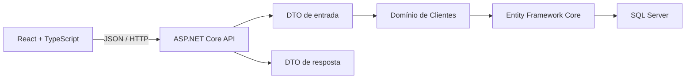

# Ficha Digital

Aplicação full stack para substituir fichas de anamnese em papel por um fluxo
digital seguro e estruturado para estúdios de tatuagem.

> Projeto em desenvolvimento, criado como portfólio e estudo prático de
> ASP.NET Core, React, modelagem de domínio e persistência com SQL Server.

## Problema

Fichas em papel dificultam a leitura, a busca e a preservação do histórico dos
clientes. Elas também tornam mais difícil controlar quem acessou dados
pessoais e informações de saúde.

O projeto propõe um fluxo no qual o estúdio poderá gerar um convite seguro, o
cliente preencherá a ficha pelo celular e profissionais autorizados consultarão
as informações em uma área protegida.

## Estado atual

Já estão implementados:

- API REST com ASP.NET Core;
- frontend React integrado à API;
- página pública que valida o convite, oculta o token da URL e registra o questionário de saúde;
- formulário inicial com cadastro dos dados obrigatórios do cliente;
- módulo de clientes com entidade protegida por regras de negócio;
- validação de requisições com DTOs;
- persistência com Entity Framework Core e SQL Server;
- migrations versionadas;
- endpoint `POST /api/clientes`;
- endpoint `POST /api/clientes/{clienteId}/fichas/convites`;
- endpoint `POST /api/fichas/convites/abrir` para validar o token e iniciar o preenchimento;
- endpoint `POST /api/fichas/questionario-saude` para registrar respostas pelo token;
- endpoint `POST /api/fichas/termo-consentimento/aceitar` para registrar o aceite e concluir a ficha;
- limitação de requisições por IP nos endpoints públicos que recebem tokens;
- respostas HTTP separadas das entidades de domínio;
- primeiros testes unitários das regras de domínio;
- primeiro teste de integração do cadastro via HTTP;
- modelagem e persistência inicial de fichas com vínculo ao cliente e estados controlados;
- geração criptográfica e persistência inicial de convites seguros;
- questionário de saúde versionado, com validações condicionais e condições clínicas;
- aceite eletrônico com versão, cópia exata do termo, hash do conteúdo, nome declarado e data em UTC;
- conclusão da ficha somente depois do questionário e do aceite do termo;
- pipeline de integração contínua para backend e frontend.

O sistema ainda não está pronto para produção e não deve receber dados pessoais
reais nesta fase.

## Arquitetura

Foi escolhido um **monólito modular**. A aplicação permanece simples de
executar e implantar, enquanto cada assunto do negócio fica organizado em seu
próprio módulo.



No módulo de clientes:

```text
Modules/Clientes/
├── Api/             # Controllers e contratos HTTP
├── Domain/          # Entidades e regras de negócio
└── Infrastructure/  # Mapeamento do Entity Framework
```

Essa separação evita retornar entidades diretamente pela API e reduz o risco de
expor propriedades internas ou dados sensíveis por acidente.

## Tecnologias

### Backend

- C#;
- .NET 10;
- ASP.NET Core Web API;
- Entity Framework Core 10;
- xUnit v3;
- SQL Server LocalDB no desenvolvimento.

### Frontend

- React 19;
- TypeScript;
- Vite;
- CSS responsivo.

### Qualidade e automação

- migrations versionadas;
- validação no domínio e na fronteira HTTP;
- testes unitários e de integração;
- lint e build do frontend;
- GitHub Actions.

## Estrutura do repositório

```text
FichaDigital/
├── .github/workflows/    # Integração contínua
├── docs/                 # Decisões, etapas e exercícios
├── src/
│   ├── backend/
│   │   └── FichaDigital.Api/
│   └── frontend/
├── tests/
│   └── backend/
│       ├── FichaDigital.IntegrationTests/
│       └── FichaDigital.UnitTests/
├── FichaDigital.sln
└── README.md
```

## Executando localmente

### Pré-requisitos

- [.NET SDK 10](https://dotnet.microsoft.com/download/dotnet/10.0);
- [Node.js 24](https://nodejs.org/);
- SQL Server LocalDB ou outra instância do SQL Server;
- npm.

### 1. Restaurar backend e ferramentas

Na raiz do repositório:

```powershell
dotnet restore
dotnet tool restore
```

### 2. Criar ou atualizar o banco

```powershell
dotnet tool run dotnet-ef database update `
  --project src/backend/FichaDigital.Api `
  --startup-project src/backend/FichaDigital.Api
```

A configuração padrão cria o banco local `FichaDigitalDb`.

### 3. Executar a API

```powershell
dotnet run --project src/backend/FichaDigital.Api --launch-profile http
```

A API ficará disponível em:

```text
http://localhost:5057
```

### 4. Executar o frontend

Em outro terminal:

```powershell
npm --prefix src/frontend install
npm --prefix src/frontend run dev
```

Abra o endereço informado pelo Vite, normalmente:

```text
http://localhost:5173
```

## Exemplo da API

### Criar cliente

```http
POST /api/clientes
Content-Type: application/json
```

```json
{
  "nomeCompleto": "Ana Silva",
  "nomeSocial": "Ana",
  "pronomes": "ela/dela",
  "dataNascimento": "1995-06-15",
  "celular": "21999999999",
  "email": "ana@example.com"
}
```

Resposta `201 Created`:

```json
{
  "id": "84bdf1ac-f68f-44a5-a20c-c5b92fc649a4",
  "nomeParaExibicao": "Ana",
  "pronomes": "ela/dela",
  "criadoEmUtc": "2026-07-25T12:00:00+00:00"
}
```

Os valores acima são fictícios.

## Decisões técnicas

- **SQL Server:** escolhido por sua integração com .NET e para aprofundar
  conhecimentos já adquiridos.
- **Fluent API:** mantém detalhes de persistência fora da entidade de domínio.
- **DTOs separados:** controlam o que entra e o que sai da API.
- **Guid:** permite gerar identificadores sem depender de uma sequência do
  banco.
- **Monólito modular:** mantém a complexidade adequada ao estágio atual, mas
  prepara o sistema para novos módulos.

## Roadmap

- [x] Estrutura inicial da API e do frontend;
- [x] Comunicação entre React e ASP.NET Core;
- [x] Entidade e persistência de clientes;
- [x] Primeiro endpoint de cadastro;
- [x] Formulário responsivo para o cadastro inicial;
- [x] Primeiros testes unitários e de integração;
- [x] Modelagem e persistência inicial do módulo de fichas;
- [x] Convites com tokens aleatórios armazenados como hash;
- [x] Questionário de saúde versionado;
- [x] Fluxo técnico de aceite eletrônico e conclusão da ficha;
- [x] Abertura do convite e questionário de saúde na página pública React;
- [ ] Consulta de clientes;
- [ ] Aceite do termo e conclusão na página pública React;
- [ ] Modelagem do histórico de procedimentos validada com o estúdio;
- [ ] Revisão jurídica e publicação do termo de consentimento definitivo;
- [ ] Autenticação e autorização do estúdio;
- [ ] Ampliação da cobertura de testes automatizados;
- [ ] Auditoria, backup e preparação para produção.

## Privacidade

O domínio futuro incluirá informações de saúde, consideradas dados pessoais
sensíveis. Por isso, segurança, finalidade da coleta, controle de acesso,
auditoria e retenção de dados fazem parte da arquitetura desde a concepção.

Este repositório usa apenas dados fictícios e não representa, no estado atual,
uma solução pronta ou juridicamente validada para tratamento de dados reais.
Consulte também a [política de segurança](SECURITY.md).

## Documentação do aprendizado

- [Especificação inicial do MVP](docs/01-especificacao-mvp.md);
- [Primeira integração](docs/02-etapa-1-primeira-integracao.md);
- [Modelo de domínio](docs/03-etapa-2a-modelo-cliente.md);
- [Entity Framework e SQL Server](docs/04-etapa-2b-entity-framework.md);
- [Endpoint de cadastro](docs/05-etapa-2c-cadastrar-cliente.md);
- [Decisão sobre o SQL Server](docs/decisoes/001-sql-server.md).

## Sobre o desenvolvimento

O projeto está sendo construído em entregas pequenas. Cada etapa registra as
decisões, os conceitos estudados e exercícios implementados no código real.
Essa abordagem permite demonstrar não apenas o resultado, mas também a evolução
do raciocínio técnico.
