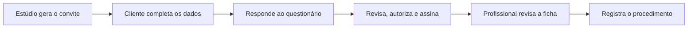
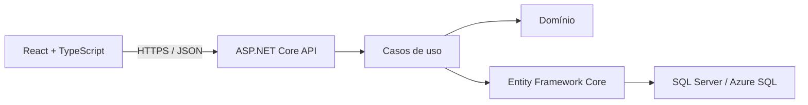

# Ficha Digital — Manuscrito Estúdio

[](https://github.com/Felipe-everardo/ficha-digital/actions/workflows/ci.yml)
[](https://github.com/Felipe-everardo/ficha-digital/actions/workflows/main_fichadigital.yml)

Aplicação full stack criada para substituir fichas de anamnese em papel por um
fluxo digital seguro, rastreável e acessível pelo celular para estúdios de
tatuagem e piercing.

**[Acessar a aplicação publicada](https://fichadigital-f0ffagenh8gegvea.eastus-01.azurewebsites.net/profissional/entrar)**

## Acesso de demonstração

```text
E-mail: feeverardo@gmail.com
Senha: @FePassword123
```

A conta e os dados disponíveis são fictícios e destinados exclusivamente à
avaliação do projeto. O MVP ainda não deve receber dados pessoais reais.

## Problema e solução

O projeto nasceu de um problema real: formulários em papel dificultavam a
leitura, a localização de fichas antigas e a preservação do histórico dos
clientes.

Com o FichaDigital, o estúdio cadastra uma referência do cliente, informa o
profissional e o procedimento e gera um convite temporário. Pelo celular, o
cliente completa seus dados, responde ao questionário de saúde e registra o
consentimento. Depois, o profissional revisa a ficha e conclui o registro
técnico do atendimento.



## Principais funcionalidades

### Área profissional

- autenticação e sessão protegida;
- cadastro, busca e histórico de clientes;
- emissão de convites temporários para tatuagem ou piercing;
- acompanhamento e filtragem das fichas por estado;
- revisão da ficha e confirmação da identidade do cliente;
- registro técnico, financeiro e da assinatura do profissional.

### Experiência do cliente

- acesso por link temporário e retomada pelo mesmo convite;
- preenchimento ou atualização dos dados pessoais;
- questionário de saúde com perguntas condicionais;
- revisão do termo, autorização e assinatura pelo celular;
- preservação do conteúdo confirmado em cada atendimento.

## Arquitetura e qualidade

O projeto é um **monólito modular** desenvolvido com princípios de **Clean
Code** e **SOLID**, organizado por funcionalidades e com separação entre API,
aplicação, domínio e infraestrutura. A arquitetura evolui gradualmente em
direção à **Clean Architecture**, priorizando baixo acoplamento, regras de
negócio isoladas e facilidade de manutenção e testes.



Entre as decisões técnicas aplicadas estão:

- **Separação de responsabilidades:** controllers enxutos, contratos HTTP
  explícitos e casos de uso separados das regras de domínio e persistência.
- **Segurança:** ASP.NET Core Identity, cookies `HttpOnly`, antiforgery, rate
  limiting, bloqueio de login e tokens de convite armazenados por hash.
- **Integridade e confiabilidade:** auditoria gravada com a operação,
  idempotência contra reenvios e concorrência otimista nas fichas.
- **Privacidade e histórico:** dados confirmados, questionários, termos e
  assinaturas são preservados sem duplicar conteúdo clínico na auditoria.
- **Observabilidade:** health checks, respostas `ProblemDetails`, logs
  estruturados e código de correlação ponta a ponta.
- **Qualidade e entrega:** testes unitários, de integração e de navegador,
  CI/CD com GitHub Actions e publicação no Azure App Service por OIDC.

## Tecnologias

| Camada | Tecnologias |
| --- | --- |
| Backend | C#, .NET 10, ASP.NET Core Web API e Entity Framework Core 10 |
| Autenticação | ASP.NET Core Identity, cookies seguros e antiforgery |
| Frontend | React 19, TypeScript, Vite e CSS responsivo |
| Banco de dados | SQL Server LocalDB e Azure SQL Database |
| Testes | xUnit v3 e Playwright |
| DevOps | GitHub Actions, Azure App Service e OIDC |

## Estrutura do projeto

```text
src/
├── backend/FichaDigital.Api/
│   ├── Modules/                 # Clientes, fichas e profissionais
│   └── Infrastructure/          # Banco, autenticação, auditoria e web
└── frontend/                    # Interface React

tests/backend/
├── FichaDigital.UnitTests/
└── FichaDigital.IntegrationTests/
```

## Documentação

- [Ambiente local, testes e referência da API](docs/desenvolvimento-local.md)
- [Operação e publicação em produção](docs/operacao-producao.md)
- [Decisões arquiteturais](docs/decisoes)
- [Planejamento funcional](docs/planejamento-fichas.md)
- [Política de segurança](SECURITY.md)

## Próximas evoluções

- recuperação de acesso e troca obrigatória da senha inicial;
- exportação de fichas e definição da política de retenção e backup;
- validação jurídica e operacional antes do uso com dados reais.

## Autor

Desenvolvido por [Felipe Everardo](https://github.com/Felipe-everardo) como
solução para um problema real e projeto de portfólio full stack.
