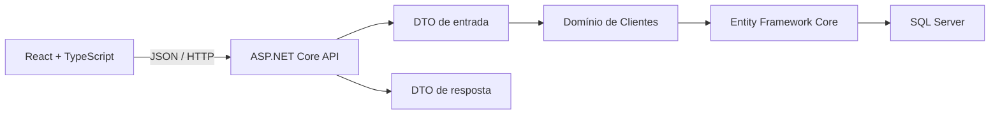

# Ficha Digital

Aplicação full stack para substituir fichas de anamnese em papel por um fluxo
digital seguro e estruturado para estúdios de tatuagem.

> Projeto em desenvolvimento, criado como portfólio e estudo prático de
> ASP.NET Core, React, modelagem de domínio e persistência com SQL Server.

## Problema

Fichas em papel dificultam a leitura, a busca e a preservação do histórico dos
clientes. Elas também tornam mais difícil controlar quem acessou dados
pessoais e informações de saúde.

O projeto propõe um fluxo no qual o estúdio poderá gerar um convite seguro, o
cliente preencherá a ficha pelo celular e profissionais autorizados consultarão
as informações em uma área protegida.

## Estado atual

Já estão implementados:

- API REST com ASP.NET Core;
- frontend React integrado à API;
- página pública que valida o convite, oculta o token da URL, registra o questionário e conclui a ficha pelo aceite;
- retomada segura pelo link original quando o questionário já foi respondido, sem devolver respostas de saúde;
- formulário inicial com cadastro dos dados obrigatórios do cliente;
- módulo de clientes com entidade protegida por regras de negócio;
- validação de requisições com DTOs;
- persistência com Entity Framework Core e SQL Server;
- migrations versionadas;
- endpoint `POST /api/clientes`;
- endpoint `POST /api/clientes/{clienteId}/fichas/convites`;
- endpoint `POST /api/fichas/convites/abrir` para validar o token e iniciar o preenchimento;
- endpoint `POST /api/fichas/questionario-saude` para registrar respostas pelo token;
- endpoint `POST /api/fichas/termo-consentimento/aceitar` para registrar o aceite e concluir a ficha;
- endpoints de entrada, saída e consulta da sessão profissional;
- cadastro de clientes e emissão de convites restritos a profissionais autenticados e protegidos contra requisições antifalsificadas;
- consulta paginada e protegida de clientes, sem incluir respostas de saúde;
- geração de convite pela lista de clientes, com link completo pronto para cópia;
- acompanhamento paginado e protegido dos estados das fichas, sem expor respostas clínicas na visão geral;
- detalhe protegido da ficha com identificação, questionário de saúde e resumo do aceite, sem cache no navegador;
- limitação de requisições por IP nos endpoints públicos que recebem tokens;
- autenticação profissional com ASP.NET Core Identity, cookie `HttpOnly`, bloqueio por tentativas e proteção antifalsificação;
- tela de login e estrutura inicial da área protegida do profissional;
- respostas HTTP separadas das entidades de domínio;
- primeiros testes unitários das regras de domínio;
- primeiro teste de integração do cadastro via HTTP;
- modelagem e persistência inicial de fichas com vínculo ao cliente e estados controlados;
- geração criptográfica e persistência inicial de convites seguros;
- questionário de saúde versionado, com validações condicionais e condições clínicas;
- aceite eletrônico com versão, cópia exata do termo, hash do conteúdo, nome declarado e data em UTC;
- conclusão da ficha somente depois do questionário e do aceite do termo;
- pipeline de integração contínua para backend e frontend.

O sistema ainda não está pronto para produção e não deve receber dados pessoais
reais nesta fase.

## Arquitetura

Foi escolhido um **monólito modular**. A aplicação permanece simples de
executar e implantar, enquanto cada assunto do negócio fica organizado em seu
próprio módulo.



No módulo de clientes:

```text
Modules/Clientes/
├── Api/             # Controllers e contratos HTTP
├── Domain/          # Entidades e regras de negócio
└── Infrastructure/  # Mapeamento do Entity Framework
```

Essa separação evita retornar entidades diretamente pela API e reduz o risco de
expor propriedades internas ou dados sensíveis por acidente.

## Tecnologias

### Backend

- C#;
- .NET 10;
- ASP.NET Core Web API;
- Entity Framework Core 10;
- ASP.NET Core Identity;
- xUnit v3;
- SQL Server LocalDB no desenvolvimento.

### Frontend

- React 19;
- TypeScript;
- Vite;
- CSS responsivo.

### Qualidade e automação

- migrations versionadas;
- validação no domínio e na fronteira HTTP;
- testes unitários e de integração;
- lint e build do frontend;
- GitHub Actions.

## Estrutura do repositório

```text
FichaDigital/
├── .github/workflows/    # Integração contínua
├── docs/                 # Decisões, etapas e exercícios
├── src/
│   ├── backend/
│   │   └── FichaDigital.Api/
│   └── frontend/
├── tests/
│   └── backend/
│       ├── FichaDigital.IntegrationTests/
│       └── FichaDigital.UnitTests/
├── FichaDigital.sln
└── README.md
```

## Executando localmente

### Pré-requisitos

- [.NET SDK 10](https://dotnet.microsoft.com/download/dotnet/10.0);
- [Node.js 24](https://nodejs.org/);
- SQL Server LocalDB ou outra instância do SQL Server;
- npm.

### 1. Restaurar backend e ferramentas

Na raiz do repositório:

```powershell
dotnet restore
dotnet tool restore
```

### 2. Criar ou atualizar o banco

```powershell
dotnet tool run dotnet-ef database update `
  --project src/backend/FichaDigital.Api `
  --startup-project src/backend/FichaDigital.Api
```

A configuração padrão cria o banco local `FichaDigitalDb`.

### 3. Configurar uma conta profissional local

Em desenvolvimento, a primeira conta pode ser provisionada com o gerenciador
de segredos do .NET. Assim, a senha fica fora do `appsettings.json` e não é
enviada ao GitHub:

```powershell
dotnet user-secrets set "ProfissionalDesenvolvimento:NomeCompleto" "Profissional de Teste" `
  --project src/backend/FichaDigital.Api

dotnet user-secrets set "ProfissionalDesenvolvimento:Email" "profissional@example.com" `
  --project src/backend/FichaDigital.Api

dotnet user-secrets set "ProfissionalDesenvolvimento:Senha" "Substitua-Esta-Senha-123!" `
  --project src/backend/FichaDigital.Api
```

Os dados acima são fictícios. Escolha uma senha diferente para o seu ambiente.
Ela deve ter ao menos 12 caracteres, letras maiúsculas e minúsculas, número e
caractere especial. A conta é criada na próxima inicialização da API, se ainda
não existir, e esse provisionamento só funciona no ambiente de desenvolvimento.

### 4. Executar a API

```powershell
dotnet run --project src/backend/FichaDigital.Api --launch-profile http
```

A API ficará disponível em:

```text
http://localhost:5057
```

### 5. Executar o frontend

Em outro terminal:

```powershell
npm --prefix src/frontend install
npm --prefix src/frontend run dev
```

Abra o endereço informado pelo Vite, normalmente:

```text
http://localhost:5173
```

A tela de acesso profissional fica em:

```text
http://localhost:5173/profissional/entrar
```

Depois do login, o painel permite acessar o cadastro protegido de clientes em
`/profissional/clientes/novo` e a lista paginada em
`/profissional/clientes`.

Na lista, a ação **Gerar novo convite** cria uma nova ficha com link válido por
48 horas. O token original é exibido apenas na resposta dessa emissão e pode ser
copiado para envio ao cliente; no banco de dados permanece somente o hash do
token.

O painel de fichas fica em `/profissional/fichas` e apresenta cliente, estado,
data de criação e validade do convite. Respostas de saúde e dados do aceite não
são incluídos nessa listagem resumida.

O profissional pode abrir `/profissional/fichas/{fichaId}` para consultar o
detalhe da ficha. Essa resposta exige autenticação, usa `Cache-Control:
no-store` e não inclui o token do convite, hashes ou a cópia integral do termo.
Enquanto o projeto estiver em demonstração, essa tela deve ser usada somente
com dados fictícios.

## Exemplo da API

### Criar cliente

Esta é uma operação administrativa. Ela exige o cookie da sessão profissional
e o cabeçalho `X-CSRF-TOKEN`; o frontend obtém e envia ambos automaticamente.

```http
POST /api/clientes
Content-Type: application/json
```

```json
{
  "nomeCompleto": "Ana Silva",
  "nomeSocial": "Ana",
  "pronomes": "ela/dela",
  "dataNascimento": "1995-06-15",
  "celular": "21999999999",
  "email": "ana@example.com"
}
```

Resposta `201 Created`:

```json
{
  "id": "84bdf1ac-f68f-44a5-a20c-c5b92fc649a4",
  "nomeParaExibicao": "Ana",
  "pronomes": "ela/dela",
  "criadoEmUtc": "2026-07-25T12:00:00+00:00"
}
```

Os valores acima são fictícios.

## Decisões técnicas

- **SQL Server:** escolhido por sua integração com .NET e para aprofundar
  conhecimentos já adquiridos.
- **Fluent API:** mantém detalhes de persistência fora da entidade de domínio.
- **DTOs separados:** controlam o que entra e o que sai da API.
- **Guid:** permite gerar identificadores sem depender de uma sequência do
  banco.
- **Monólito modular:** mantém a complexidade adequada ao estágio atual, mas
  prepara o sistema para novos módulos.

## Roadmap

- [x] Estrutura inicial da API e do frontend;
- [x] Comunicação entre React e ASP.NET Core;
- [x] Entidade e persistência de clientes;
- [x] Primeiro endpoint de cadastro;
- [x] Formulário responsivo para o cadastro inicial;
- [x] Primeiros testes unitários e de integração;
- [x] Modelagem e persistência inicial do módulo de fichas;
- [x] Convites com tokens aleatórios armazenados como hash;
- [x] Questionário de saúde versionado;
- [x] Fluxo técnico de aceite eletrônico e conclusão da ficha;
- [x] Abertura do convite e questionário de saúde na página pública React;
- [x] Aceite do termo e confirmação final na página pública React;
- [x] Base de autenticação profissional e sessão protegida no backend;
- [x] Tela de login e estrutura inicial da área profissional;
- [x] Proteção das operações administrativas de clientes e convites;
- [x] Consulta paginada de clientes na área profissional;
- [x] Geração e cópia do convite a partir da lista de clientes;
- [x] Acompanhamento das fichas e de seus estados na área profissional;
- [x] Detalhe protegido da ficha para o ambiente de demonstração;
- [ ] Demonstração do MVP ao estúdio usando somente dados fictícios;
- [ ] Perfis de acesso e autorização por função;
- [ ] Modelagem do histórico de procedimentos validada com o estúdio;
- [ ] Revisão jurídica e publicação do termo de consentimento definitivo;
- [ ] Ampliação da cobertura de testes automatizados;
- [ ] Auditoria, backup e preparação para produção.

## Privacidade

O domínio futuro incluirá informações de saúde, consideradas dados pessoais
sensíveis. Por isso, segurança, finalidade da coleta, controle de acesso,
auditoria e retenção de dados fazem parte da arquitetura desde a concepção.

Este repositório usa apenas dados fictícios e não representa, no estado atual,
uma solução pronta ou juridicamente validada para tratamento de dados reais.
Consulte também a [política de segurança](SECURITY.md).

## Documentação

- [Roteiro de demonstração do MVP](docs/roteiro-demonstracao-mvp.md).

## Sobre o desenvolvimento

O projeto está sendo construído em entregas pequenas. Cada etapa registra as
decisões, os conceitos estudados e exercícios implementados no código real.
Essa abordagem permite demonstrar não apenas o resultado, mas também a evolução
do raciocínio técnico.
