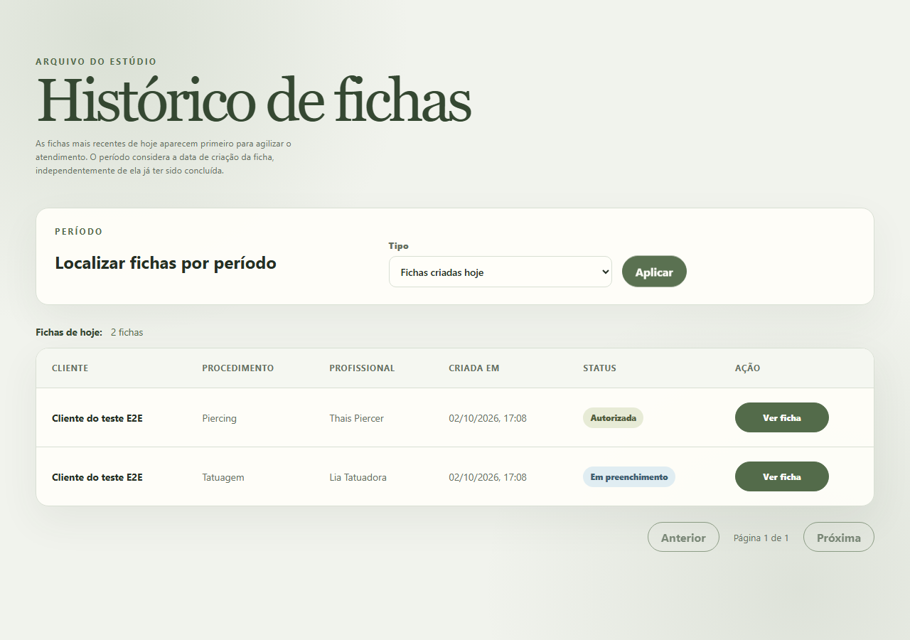
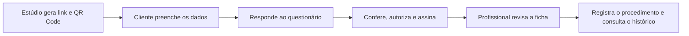
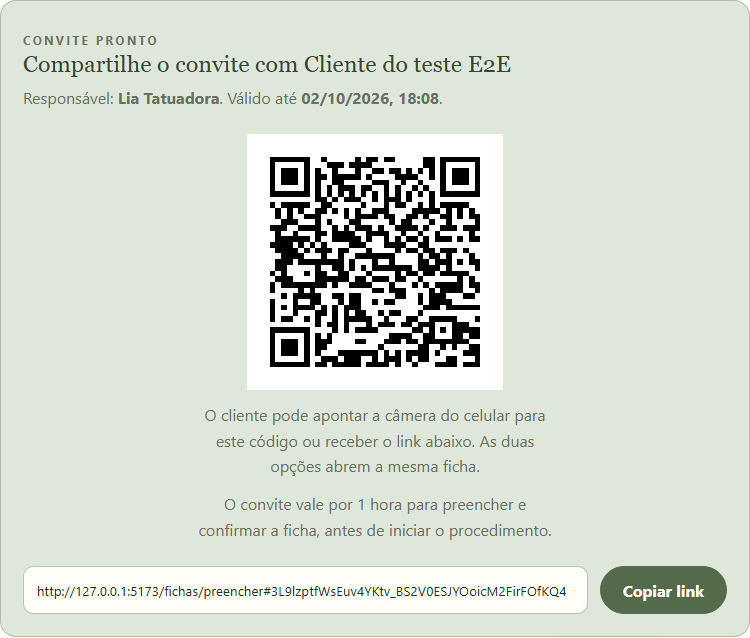
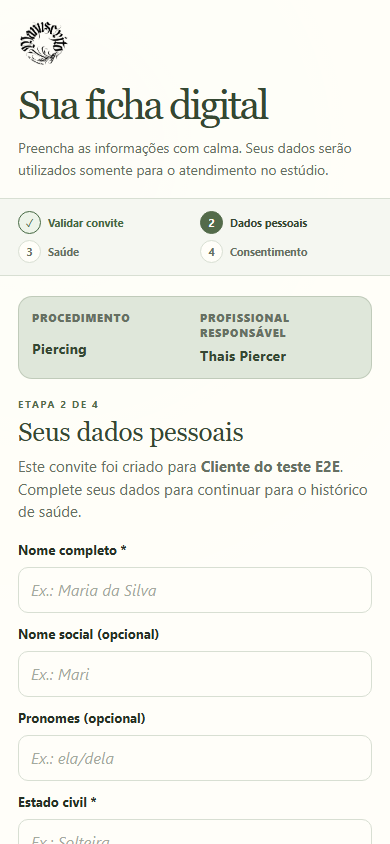

# Ficha Digital — Manuscrito Estúdio

[](https://github.com/Felipe-everardo/ficha-digital/actions/workflows/ci.yml)
[](https://github.com/Felipe-everardo/ficha-digital/actions/workflows/main_fichadigital.yml)

**Da anamnese em papel ao histórico digital de atendimento.** Aplicação full
stack para estúdios de tatuagem e piercing, desenvolvida por
[Felipe Everardo](https://github.com/Felipe-everardo) como projeto de portfólio
e também voltado à resolver um problema do mundo real.

O profissional gera um convite; o cliente preenche e assina pelo celular; o
estúdio revisa a ficha e registra o procedimento. O projeto reúne **C#/.NET 10,
React, TypeScript, SQL Server, testes automatizados e deploy no Azure**.

[Acessar demonstração](https://fichadigital-f0ffagenh8gegvea.eastus-01.azurewebsites.net/profissional/entrar)
· [Roteiro de avaliação](docs/demonstracao.md)
· [Executar localmente](docs/desenvolvimento-local.md)
· [Decisões técnicas](docs/decisoes)

> **MVP de demonstração.** Use somente dados e assinaturas fictícios.
> A preparação operacional para atender clientes reais ainda está pendente.



## Experimente o projeto

| Acesso público de demonstração | Valor |
| --- | --- |
| E-mail | `feeverardo@gmail.com` |
| Senha | `@FePassword123` |

Essas credenciais são exclusivas da demonstração. Não representam uma conta
que deva ser reutilizada em produção.

1. Entre e consulte **Clientes** ou **Histórico** para explorar os registros.
2. Cadastre uma referência fictícia de cliente e gere um convite, informando
   profissional e procedimento.
3. Copie o link para outra aba ou leia o QR Code com o celular.
4. Preencha dados fictícios, responda ao questionário e registre uma assinatura
   de teste. Depois, volte à área profissional e abra a ficha.

O convite vale por **uma hora desde a emissão** para preenchimento e aceite;
esse prazo não limita a duração do procedimento. O [roteiro completo](docs/demonstracao.md)
inclui revisão profissional e registro posterior do atendimento.

## O problema que orienta o projeto

Formulários em papel dificultam a leitura, a busca de atendimentos anteriores
e a conferência das informações antes de um procedimento. O Ficha Digital
organiza esse trabalho em etapas e preserva os dados confirmados em cada ficha.


```mermaid
flowchart LR
    A[Estúdio gera link e QR Code] --> B[Cliente preenche os dados]
    B --> C[Responde ao questionário]
    C --> D[Confere, autoriza e assina]
    D --> E[Profissional revisa a ficha]
    E --> F[Registra o procedimento e consulta o histórico]
```

## Interface

Capturas da execução local, com banco temporário e dados exclusivamente fictícios.

<table>
  <tr>
    <th>Compartilhamento do convite</th>
    <th>Preenchimento no celular</th>
  </tr>
  <tr>
    <td></td>
    <td></td>
  </tr>
</table>

Os convites das capturas pertencem ao ambiente temporário de teste e não são
links para atendimento.

## Funcionalidades implementadas

| Área profissional | Experiência do cliente |
| --- | --- |
| Login da conta do estúdio | Acesso por convite temporário, sem criar conta |
| Cadastro, busca e histórico de clientes | Confirmação ou preenchimento dos dados pessoais |
| Convite para tatuagem ou piercing, por link e QR Code | Questionário de saúde com perguntas condicionais |
| Filtros pela data de criação: hoje, dia, mês e ano | Revisão das informações, consentimento único e assinatura desenhada |
| Revisão e registro técnico e financeiro do atendimento | Retomada do convite válido e início de cada etapa no topo da tela |

## Arquitetura e decisões técnicas

O backend é um **monólito organizado em módulos** de clientes, fichas e
profissionais. Cada módulo separa contratos HTTP, casos de uso, domínio e
infraestrutura. O frontend consome a API e usa componentes e hooks para
organizar as telas e o fluxo de preenchimento.

| Decisão | Motivação e evidência no código |
| --- | --- |
| Casos de uso independentes do EF Core | A aplicação depende de contratos de consulta e persistência; a infraestrutura implementa o acesso ao banco. Testes verificam as dependências, regras de revisão e atomicidade das gravações. [ADR 0004](docs/decisoes/0004-contratos-de-persistencia.md). |
| Conta única do estúdio no MVP | Reduz o gerenciamento de usuários; o responsável é registrado por ficha. A limitação de autoria individual está documentada na [ADR 0001](docs/decisoes/0001-conta-unica-e-responsavel-por-ficha.md). |
| Convite com token armazenado por hash | Permite acesso temporário sem cadastro do cliente. Novos links usam fragmento `#`, que não acompanha a requisição HTTP inicial; o QR é gerado no navegador. [Emissão](src/backend/FichaDigital.Api/Modules/Fichas/Api/Convites/ConvitesFichaController.cs) e [leitura do convite](src/frontend/src/hooks/useFichaPublica.ts). |
| Auditoria e idempotência | Registra ações sem copiar informações clínicas para a auditoria e permite recuperar a resposta de uma operação reenviada com a mesma chave. [ADR 0002](docs/decisoes/0002-auditoria-e-idempotencia.md). |
| Concorrência otimista | Detecta alterações concorrentes na ficha para evitar sobrescrita silenciosa. [Testes com SQL Server](tests/backend/FichaDigital.IntegrationTests/Infrastructure/SqlServer/SqlServerCompatibilityTests.cs). |
| Dados preservados por atendimento | A ficha mantém as informações confirmadas, questionário, versão do termo e evidências do aceite. [Domínio de fichas](src/backend/FichaDigital.Api/Modules/Fichas/Domain). |
| Saúde e diagnóstico | Separa processo ativo de banco pronto, detecta migrations pendentes no SQL Server e usa códigos de correlação. [ADR 0003](docs/decisoes/0003-observabilidade-e-falhas.md). |

Autenticação utiliza ASP.NET Core Identity e cookies. A API também aplica
antiforgery, limitação de requisições e cabeçalhos defensivos. Esses controles
não representam certificação de segurança ou de conformidade jurídica.

## Tecnologias

| Camada | Tecnologias |
| --- | --- |
| Backend | C#, .NET 10, ASP.NET Core, Entity Framework Core 10 |
| Frontend | React 19, TypeScript, Vite, CSS responsivo, qrcode.react |
| Persistência | SQL Server / Azure SQL; SQLite no E2E e em parte dos testes |
| Testes | xUnit v3, Playwright e SQL Server descartável com Testcontainers |
| Entrega | GitHub Actions e Azure App Service, com autenticação de deploy por OIDC |

## Executar e verificar

Pré-requisitos para o ambiente local padrão: **.NET SDK 10, Node.js 24 com npm
e SQL Server LocalDB**. Para outra instância SQL Server, configure a conexão.
O [guia local](docs/desenvolvimento-local.md) descreve migrations, criação da
conta e inicialização dos dois servidores.

Na raiz do repositório:

```powershell
dotnet restore
npm --prefix src/frontend ci
dotnet test FichaDigital.sln
npm --prefix src/frontend run lint
npm --prefix src/frontend run build
```

Para o fluxo de navegador, pare os servidores locais que usam as portas 5057
e 5173 e execute:

```powershell
npm --prefix src/frontend exec -- playwright install chromium
npm --prefix src/frontend run test:e2e
```

O E2E inicia API, frontend e banco SQLite temporário. Cinco cenários independentes
cobrem login e cadastro, links, QR Code no celular, preenchimento com assinatura
e filtros. Cada cenário prepara seus próprios dados pela API real; login e
cadastro também são exercitados pela interface.

O deploy chama o mesmo CI usado nos pull requests e só prepara e publica o
pacote após backend, SQL Server, lint, build e E2E passarem para o mesmo commit.
Após a publicação, verifica a saúde da aplicação e o acesso ao esquema do banco.

Os testes específicos de SQL Server exigem Docker e `RUN_SQLSERVER_TESTS=true`.
Sem essa configuração, são ignorados localmente; o CI os habilita. Consulte os
[comandos e limites da suíte](docs/desenvolvimento-local.md#testes-opcionais-com-sql-server-real).

## Organização do repositório

```text
src/backend/FichaDigital.Api/
├── Modules/                    # Clientes, fichas e profissionais
├── Features/Status/            # Saúde da aplicação
└── Infrastructure/             # Persistência, auditoria, idempotência e web
src/frontend/
├── src/                        # Páginas, componentes, hooks e serviços HTTP
└── e2e/                        # Fluxo automatizado no navegador
tests/backend/                  # Testes unitários e de integração
docs/                           # Guias, decisões e preparação para produção
```

## Evolução e limites atuais

O foco atual é uma demonstração funcional e reproduzível para avaliação
técnica. **Ainda não está validado para armazenar dados reais de clientes.**

- A conta compartilhada não identifica individualmente cada operador.
- A demonstração usa dados compartilhados; não há isolamento por visitante.
- O deploy ainda precisa de uma etapa controlada para aplicar migrations.
- Backup restaurado em ambiente isolado, recuperação das chaves e separação
  entre demo e produção ainda precisam ser comprovados antes do uso real.
- Recuperação de acesso, exportação de fichas e definição de retenção estão
  entre as próximas evoluções.

Veja o [plano de evolução por ambiente](docs/evolucao.md), o
[runbook de produção](docs/operacao-producao.md) e a [política de segurança](SECURITY.md).
